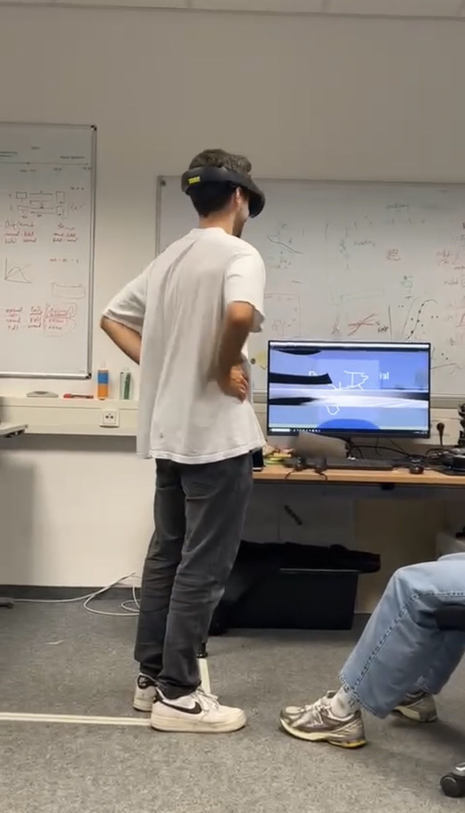
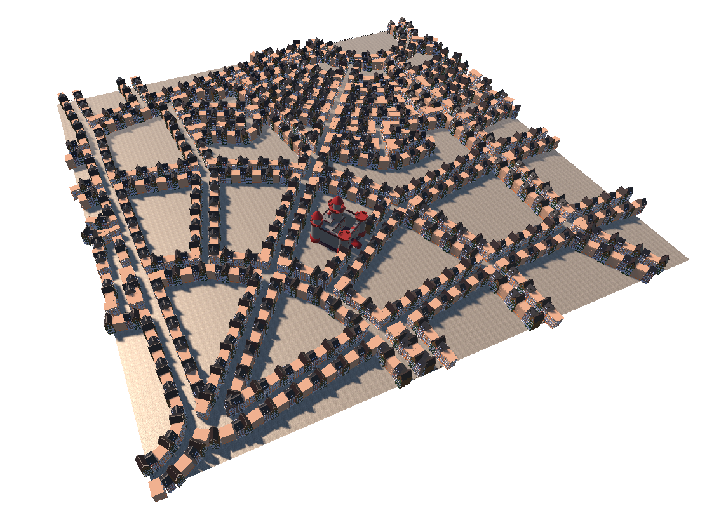
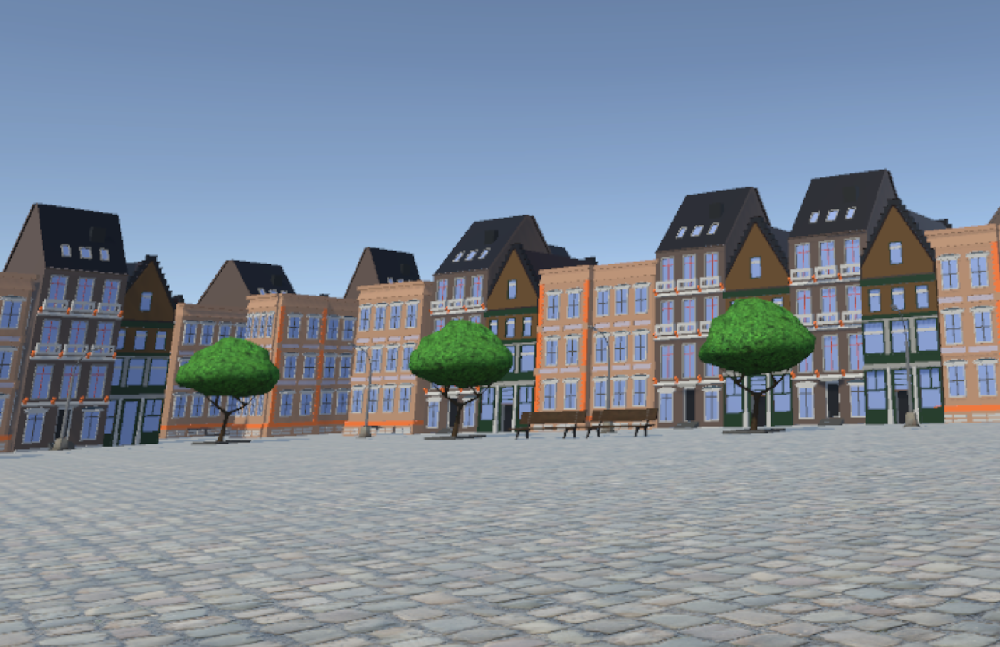

# Expra
Description of Coding during the psychological experimental internship

Our group developed a VR experiment in Unity in which participants walked through a city and navigated using a map. The participants were supposed to find a target goal. Our team collected data so that we could make assumptions about how people navigate through cities.

